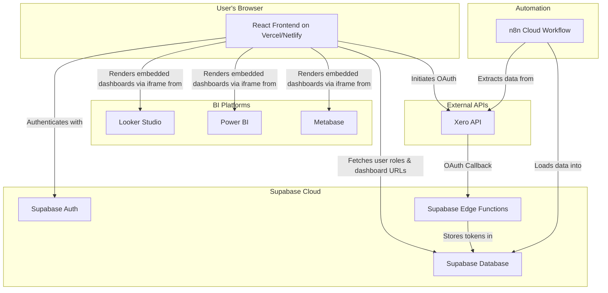

# Centralized BI Dashboard Portal

> A secure, role-based portal for accessing centralized business intelligence dashboards powered by Xero, Supabase, and n8n.

This project provides a centralized, secure, and scalable platform for internal teams to access crucial business intelligence dashboards. It solves the problem of fragmented data access by implementing strict role-based access control (RBAC), ensuring users only see the data visualizations relevant to their roles.

The system integrates with Xero as a primary data source, uses n8n for automated ETL pipelines, and leverages Supabase for backend services, including authentication, database storage, and serverless functions.


## Key Features

* **Centralized Dashboard Access:** A single, user-friendly portal for accessing all relevant BI dashboards.
* **Role-Based Access Control (RBAC):** Securely limits dashboard visibility based on user roles, enforced by Supabase Row Level Security.
* **Automated Data Pipelines:** Daily data extraction and transformation from Xero and Workflow Max via n8n workflows.
* **Multi-BI Tool Support:** Flexibly embeds dashboards from Google Looker Studio, Microsoft Power BI, and Metabase.
* **Self-Service Xero Integration:** A user-friendly wizard for securely connecting Xero accounts using OAuth 2.0.
* **Modern Tech Stack:** Built with React, Vite, TypeScript, and Supabase for a scalable and maintainable solution.

## Architecture Overview

The system is composed of five primary components: a **React Frontend**, a **Supabase Backend**, an **n8n ETL Pipeline**, external **BI Tools**, and the **Xero API**.



For more detailed information, please see the [**Architecture Document**](./docs/architecture.md).

## Built With

This project is built with a modern, powerful stack:

* **Frontend:**
  * [Vite](https://vitejs.dev/)
  * [React](https://react.dev/)
  * [TypeScript](https://www.typescriptlang.org/)
  * [shadcn-ui](https://ui.shadcn.com/)
  * [Tailwind CSS](https://tailwindcss.com/)
* **Backend & Services:**
  * [Supabase](https://supabase.com/) - for database, authentication, storage, and serverless functions.
  * [N8N](https://theaiautomators.com/go/n8n) - for workflow automation and ETL pipelines.
* **BI Tools:**
  * Google Looker Studio
  * Microsoft Power BI
  * Metabase

## Getting Started

To get a local copy up and running, follow these steps.

### Prerequisites

* Node.js (v18 or later)
* npm or bun
* A Supabase account and project
* An n8n instance (cloud or self-hosted)

### Installation

1. **Clone the repository:**

   ```sh
   git clone https://github.com/demigod97/hhpolicy-ai.git
   cd hhpolicy-ai
   ```

2. **Install dependencies:**

   ```sh
   npm install
   ```

3. **Configure Environment Variables:**

   Create a `.env` file in the root of the project by copying the example file:

   ```sh
   copy .env.example .env
   ```

   Update the `.env` file with your Supabase Project URL and Anon Key.

   ```sh
   VITE_SUPABASE_URL="YOUR_SUPABASE_URL"
   VITE_SUPABASE_ANON_KEY="YOUR_SUPABASE_ANON_KEY"
   ```

4. **Run Database Migrations:**

   Apply the necessary database schema changes located in the `supabase/migrations` folder to your Supabase project.

5. **Run the development server:**

   ```sh
   npm run dev
   ```

6. **Configure n8n Workflows:**

   The `/n8n` directory contains the JSON files for the required n8n workflows. Import these into your n8n instance and configure the credentials for Supabase and Xero.

## Contributing

Contributions make the open-source community an amazing place to learn, inspire, and create. Any contributions you make are greatly appreciated.

* Fork the Project
* Create your Feature Branch (`git checkout -b feature/AmazingFeature`)
* Commit your Changes (`git commit -m 'Add some AmazingFeature'`)
* Push to the Branch (`git push origin feature/AmazingFeature`)
* Open a Pull Request

## License

This codebase is distributed under the MIT License. See `LICENSE` for more information.

## A Note on n8n's Sustainable Use License

While this project's codebase is open-sourced under MIT, it's important to be aware that n8n, which powers the backend automation, is distributed under a [Sustainable Use License](https://github.com/n8n-io/n8n/blob/master/LICENSE.md). This license allows free usage for internal business purposes.

However, if you plan to use this project as part of a commercial SaaS offering, you may need to obtain an n8n Enterprise License. Please review the n8n license and contact their team if your use case falls into a commercial category.
