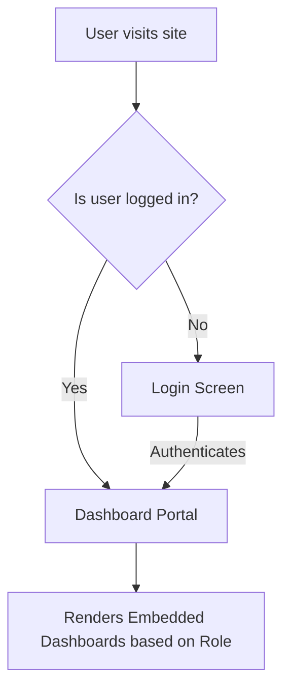
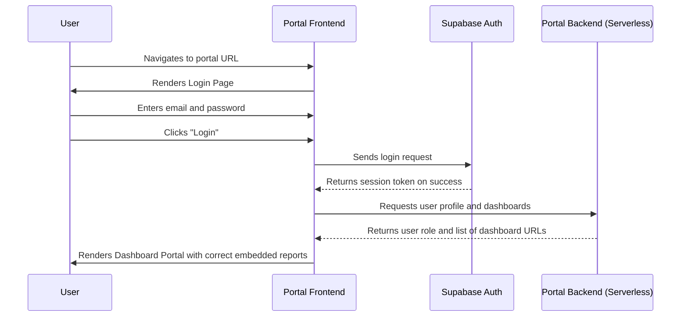

# Centralized BI Dashboard Portal UI/UX Specification

## Introduction

This document defines the user experience goals, information architecture, user flows, and visual design specifications for the Centralized BI Dashboard Portal's user interface. It serves as the foundation for visual design and frontend development, ensuring a cohesive and user-centered experience.

### Overall UX Goals & Principles

#### Target User Personas

  * **Admin (Leadership)**: Requires a comprehensive, high-level view of all business data across all departments.
  * **Role A (Sales & Marketing)**: Needs quick access to dashboards related to performance, customer acquisition, and campaign ROI.
  * **Role B (Finance & HR)**: Needs secure access to dashboards focused on financial health, P\&L, and employee metrics.

#### Usability Goals

  * **Efficiency**: Users must be able to log in and access their relevant dashboards with a minimum number of clicks.
  * **Clarity**: The interface should be clean and unambiguous, presenting the dashboards without distracting elements.
  * **Learnability**: The portal should be immediately understandable with no training required.

#### Design Principles

1.  **Clarity Above All**: Prioritize clear, easy-to-understand layouts over aesthetic complexity. The dashboards are the heroes.
2.  **Role-First Design**: The user's role is the single driver of the content they see. The interface must strictly reflect their permissions.
3.  **Performance by Default**: The portal must be lightweight and load quickly, ensuring fast access to the BI tools.

### Change Log

| Date | Version | Description | Author |
| :--- | :--- | :--- | :--- |
| 2025-09-23 | 1.0 | Initial draft of UI/UX Specification. | Sally (UX Expert) |

-----

## Information Architecture (IA)

### Site Map / Screen Inventory

The application has a very simple, flat architecture focused on getting the user to their content immediately after authentication.

### Navigation Structure

  * **Primary Navigation**: The primary navigation will be minimal. Once a user is logged in, the main view is the dashboard portal. The only persistent navigation element will be a header containing the company logo and a user profile dropdown with a "Logout" option.
  * **Secondary Navigation**: None required for the MVP.
  * **Breadcrumb Strategy**: Not applicable for the MVP's flat structure.

-----

## User Flows

### User Login & Dashboard Viewing

  * **User Goal**: A team member wants to log in and view the dashboards assigned to their role.
  * **Entry Points**: The application's root URL.
  * **Success Criteria**: The user successfully authenticates and is presented with the correct set of interactive dashboards corresponding to their assigned role.

#### Flow Diagram

#### Edge Cases & Error Handling

  * User enters invalid credentials; a clear "Invalid email or password" error is shown.
  * User is authenticated but has no role assigned in the `profiles` table; a message is shown: "Your account is not yet configured. Please contact an administrator."
  * An embedded dashboard fails to load; a container with a clear error message and a "Try Reloading" button is shown.

-----

## Wireframes & Mockups

  * **Primary Design Files**: The initial UI will be generated using an AI UI tool (like Vercel v0 or Lovable.ai) based on the Dashibase boilerplate and a detailed prompt derived from this document. There will not be a separate Figma or Sketch file for the MVP.

### Key Screen Layouts

#### Login Screen

  * **Purpose**: To securely authenticate users.
  * **Key Elements**:
      * Company Logo
      * "Email" input field with label
      * "Password" input field with label
      * "Login" button
  * **Interaction Notes**: The form should have basic client-side validation for email format and password presence.

#### Dashboard Portal

  * **Purpose**: To display the role-specific dashboards to the authenticated user.
  * **Key Elements**:
      * A persistent Header with the company logo and a user profile dropdown (containing a "Logout" button).
      * A main content area that dynamically displays one or more embedded dashboards.
  * **Interaction Notes**: For roles with multiple dashboards (like Admin), the layout should use tabs or clearly separated sections to organize the reports. The `<iframe>` elements should fill the available space to maximize visibility.

-----

## Component Library / Design System

  * **Design System Approach**: We will leverage the existing component library provided by the **Dashibase boilerplate** (likely based on Shadcn UI and Tailwind CSS). We will not create a custom design system for the MVP. All new components will be built using the established styles and conventions of the boilerplate.

### Core Components

  * **LoginForm**: A client-side component for handling user authentication.
  * **Header**: The top-level persistent header for the application.
  * **DashboardContainer**: A component that takes a URL as a prop and renders it within a styled `<iframe>`.
  * **RoleBasedLayout**: A top-level component that fetches the user's role and renders the appropriate set of `DashboardContainer` components.

-----

## Branding & Style Guide

  * **Brand Guidelines**: To follow the existing corporate brand guidelines for internal tools.

### Color Palette

| Color Type | Hex Code | Usage |
| :--- | :--- | :--- |
| Primary | `#005A9C` | Buttons, links, active states |
| Accent | `#FDB813` | Highlights, callouts |
| Success | `#2E7D32` | Success notifications |
| Error | `#C62828` | Error messages, destructive actions |
| Neutral | `#F5F5F5`, `#E0E0E0`, `#424242` | Backgrounds, borders, text |

### Typography

  * **Primary Font**: System UI (e.g., Segoe UI, San Francisco, Roboto) for performance and native feel.

| Element | Size | Weight |
| :--- | :--- | :--- |
| H1 | 2.25rem (36px) | 700 |
| H2 | 1.5rem (24px) | 600 |
| Body | 1rem (16px) | 400 |

-----

## Accessibility & Responsiveness

### Accessibility Requirements

  * **Compliance Target**: WCAG 2.1 AA.
  * **Key Requirements**:
      * All form inputs must have associated labels.
      * All interactive elements must be keyboard-navigable.
      * Focus indicators must be clearly visible.
      * Color contrast ratios must meet AA standards.

### Responsiveness Strategy

  * **Breakpoints**: Standard mobile, tablet, and desktop breakpoints will be used via Tailwind CSS.
  * **Adaptation Patterns**: The login page will be fully responsive. The dashboard portal is optimized for **desktop and tablet** viewing, as BI reports are difficult to consume on mobile screens. On mobile, the portal will render a simplified, single-column layout of dashboards.

-----

## Performance & Animation

### Animation & Micro-interactions

  * **Motion Principles**: Animations will be minimal and purposeful, used only for subtle state transitions (e.g., button clicks, loading spinners) to provide user feedback without being distracting.

### Performance Considerations

  * **Page Load**: The portal shell (excluding the embedded dashboards) must achieve a First Contentful Paint (FCP) of under 2.5 seconds.
  * **Design Strategies**: The portal will be a lightweight shell. The performance of the dashboards themselves is the responsibility of the BI tools (Looker Studio, Power BI).

-----

## Next Steps

### Immediate Actions

1.  Review and finalize this UI/UX specification.
2.  Generate a detailed prompt for an AI UI generation tool (e.g., v0) based on this spec.
3.  Handoff this document to the Architect to inform the `fullstack-architecture` document.

### Design Handoff Checklist

  * [x] All user flows documented
  * [x] Component inventory complete
  * [x] Accessibility requirements defined
  * [x] Responsive strategy clear
  * [x] Brand guidelines incorporated
  * [x] Performance goals established

-----