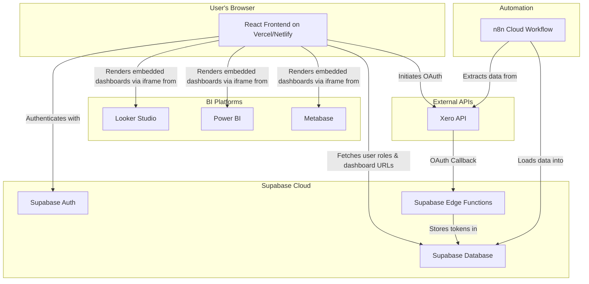
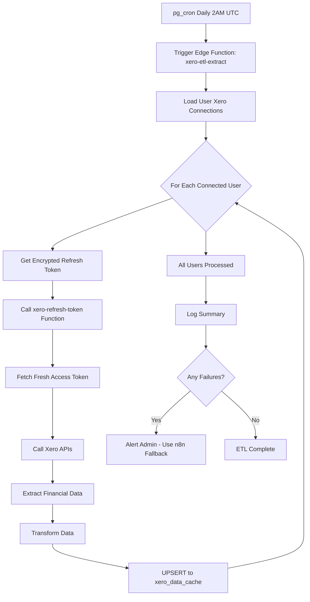
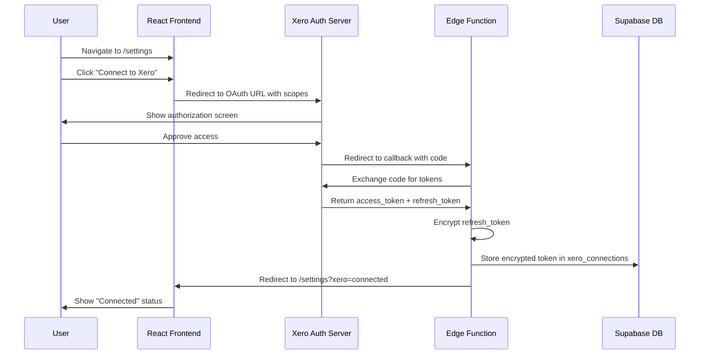

# Centralized BI Dashboard Portal - Architecture Document

**Version:** 2.0
**Date:** 2025-10-15
**Author:** Winston (Architect) - Reviewed and Corrected
**Previous Version:** 1.0 by Sarah (Product Owner)

---

## 1. Introduction

This document outlines the technical architecture for the Centralized BI Dashboard Portal. Its purpose is to provide a comprehensive blueprint for development, ensuring that the system is scalable, secure, and aligns with the project's goals as defined in the PRD.

The system is designed to be a lightweight, secure web portal that provides role-based access to embedded business intelligence dashboards. It leverages a modern, serverless-first technology stack to ensure rapid development and maintainability.

### 1.1 Brownfield Project Context

**CRITICAL:** This is a **brownfield transformation project**, not a greenfield implementation.

**Existing Infrastructure:**
- **Source Codebase:** Repurposing an existing PolicyAI application
- **Tech Stack Already in Place:** React 18.3.1 + Vite + TypeScript + Supabase
- **UI Framework:** Shadcn UI components with Tailwind CSS (already configured)
- **Routing:** react-router-dom v6 (already implemented)
- **State Management:** React Context API + TanStack Query (already configured)
- **Authentication:** Supabase Auth with AuthContext provider (already implemented)

**Legacy PolicyAI Components to Preserve but NOT Use:**
- Database tables: `notebooks`, `sources`, `documents`, `n8n_chat_histories`, `studio_notes`
- Components: `src/components/notebook/`, `src/components/chat/`
- Hooks: `useNotebooks`, `useSources`, `useChatMessages`, `useDocumentProcessing`
- Pages: `Notebook.tsx` (current implementation)

**Reusable Infrastructure:**
- ✅ `src/components/auth/` - Authentication components
- ✅ `src/components/ui/` - Complete Shadcn UI component library
- ✅ `src/contexts/AuthContext.tsx` - Auth state management (needs enhancement)
- ✅ `src/integrations/supabase/client.ts` - Configured Supabase client
- ✅ `src/hooks/use-mobile.tsx`, `use-toast.ts`, `useIsDesktop.tsx`
- ✅ `src/lib/utils.ts` - Utility functions
- ✅ Base routing structure in `App.tsx`

**Supabase Environment:**
- **Status:** Newly linked Supabase project (jprwawlxjogdwhmorfpj.supabase.co)
- **Migrations Folder:** Empty (requires initial schema setup)
- **Edge Functions Folder:** Empty (requires new function creation)
- **Connection:** Configured via environment variables in `supabase-cred.md`

**Development Approach:**
This architecture will **leverage existing infrastructure** while adding new BI-specific tables, components, and features. We will NOT rebuild authentication, routing, or UI components from scratch.

## 2. High-Level Architecture

The system is composed of five primary components: a **React Frontend**, a **Supabase Backend**, an **n8n ETL Pipeline**, external **BI Tools**, and the **Xero API**.



### Component Responsibilities

* **React Frontend:** The user-facing application. Handles user authentication, renders the dashboard portal, and manages the UI for the Xero connection wizard.
* **Supabase Backend:** Provides all backend services, including user authentication, database storage for user profiles and BI data, and serverless functions for secure API interactions.
* **n8n ETL Pipeline:** An automated workflow responsible for extracting data from Xero and loading it into the Supabase database daily.
* **BI Tools (Looker, Power BI, Metabase):** The platforms where dashboards are created. The portal embeds views from these tools.
* **Xero API:** The external data source for financial information.

## 3. Technology Stack

**CORRECTED:** This section reflects the ACTUAL stack in use, not hypothetical boilerplates.

| Category | Technology | Version | Status | Rationale |
| :--- | :--- | :--- | :--- | :--- |
| **Frontend Framework** | React + TypeScript | 18.3.1 | ✅ In Use | Already configured in existing codebase. Modern, component-based architecture with type safety. |
| **Build Tool** | Vite | Latest | ✅ In Use | Already configured. Superior dev experience with fast HMR and optimized builds. |
| **UI Components** | Shadcn UI / Tailwind CSS | Latest | ✅ In Use | Complete component library already integrated. Highly customizable with excellent accessibility. |
| **Routing** | react-router-dom | 6.26.2 | ✅ In Use | Already implemented. Modern, declarative routing with nested routes support. |
| **State Management** | React Context + TanStack Query | 5.56.2 | ✅ In Use | Already configured. Context for auth state, TanStack Query for server state. |
| **Backend-as-a-Service** | Supabase | 2.49.8 | ✅ Connected | Postgres DB, Auth, Edge Functions. Project linked: jprwawlxjogdwhmorfpj |
| **Data Automation (Primary)** | Supabase Edge Functions | - | ⚠️ To Build | Server-side ETL triggered by pg_cron. User-specific Xero data extraction. |
| **Data Automation (Fallback)** | n8n Cloud | - | ⚠️ To Configure | Backup/fallback mechanism if Edge Functions fail. Manual admin trigger. |
| **BI & Visualization** | Looker Studio, Power BI, Metabase | - | ⏳ Pending | Multiple BI tools for dashboard creation. Embedded via secure iframes. |
| **Deployment** | Vercel / Netlify | - | ⏳ Pending | Serverless deployment with automatic CI/CD from git main branch. |

**Key Stack Notes:**

1. **NO "Dashibase":** This term does not refer to a real framework. The stack is React + Vite + Supabase.
2. **Brownfield Foundation:** All base infrastructure (routing, auth, UI) already exists and functions.
3. **New Development Focus:** BI-specific components, Xero integration, role-based dashboards, ETL Edge Functions.

## 4. Frontend Architecture

The frontend is a single-page application (SPA) built with React and Vite.

* **Component Structure:** The application will follow a standard, feature-based component structure (e.g., `src/components/auth`, `src/components/dashboard`, `src/components/settings`).
* **State Management:** For simple state needs, React's native `Context` and `useState`/`useReducer` hooks will be used. For more complex, cross-application state (like user session), a lightweight library like Zustand may be considered if needed.
* **Routing:** `react-router-dom` will be used for all client-side routing (e.g., `/login`, `/dashboard`, `/settings`).
* **Data Fetching:** Direct integration with the Supabase client library (`@supabase/supabase-js`) will be used for all database interactions.

## 5. Backend Architecture (Supabase)

### 5.1. Database Schema

The Supabase Postgres database will contain the following key tables. All existing tables from the PolicyAI application will be preserved but unused.

**Legacy PolicyAI Tables (Preserved, Not Used):**

- `notebooks`, `sources`, `documents`, `n8n_chat_histories`, `studio_notes`, `notebook_sources`

These tables remain in the database but are not part of the BI Portal functionality.

**`profiles` (Existing - Requires Modification)**

Links `auth.users` to application roles.

| Column | Type | Notes |
| :--- | :--- | :--- |
| `id` | `uuid` (PK) | Foreign key to `auth.users.id` |
| `role` | `text` | **NEW FIELD TO ADD**: e.g., 'admin', 'role_a', 'role_b' |
| `...` | | Other existing profile fields (preserve) |

**`dashboards` (New Table)**
Stores information about each available dashboard.

| Column | Type | Notes |
| :--- | :--- | :--- |
| `id` | `uuid` (PK) | |
| `name` | `text` | e.g., 'Income vs Expenses' |
| `embed_url` | `text` | The `<iframe>` source URL |
| `bi_tool` | `text` | 'looker', 'powerbi', 'metabase' |

**`dashboard_permissions` (New Table)**
A many-to-many join table linking roles to the dashboards they can access.

| Column | Type | Notes |
| :--- | :--- | :--- |
| `role` | `text` (PK) | e.g., 'admin', 'role_a' |
| `dashboard_id` | `uuid` (PK, FK) | Foreign key to `dashboards.id` |

**`xero_connections` (New Table)**
Securely stores connection details for each user's Xero account.

| Column | Type | Notes |
| :--- | :--- | :--- |
| `id` | `uuid` (PK) | |
| `user_id` | `uuid` (FK) | Foreign key to `auth.users.id` |
| `tenant_id` | `uuid` | The Xero Tenant ID |
| `encrypted_refresh_token` | `text` | Refresh token encrypted at rest |
| `connected_at` | `timestamptz` | |

**`xero_data_cache` (New Table Example)**
A table to store the data pulled from Xero by the n8n pipeline.

| Column | Type | Notes |
| :--- | :--- | :--- |
| `date` | `date` | |
| `weekly_income` | `numeric` | |
| `avg_wages` | `numeric` | |
| `...` | | Other relevant financial metrics |

### 5.1.1 Database Migration Strategy

**Current State:** 
- New Supabase project linked (jprwawlxjogdwhmorfpj.supabase.co)
- `supabase/migrations/` folder is empty
- No schema deployed yet to new project

**Migration Approach:**

We will use **Supabase declarative schema management** (recommended best practice):

1. **Create Schema Definitions:** Define all tables in `supabase/schemas/` directory
2. **Generate Migrations:** Use `supabase db diff` to create migration files
3. **Apply Migrations:** Deploy to database via `supabase db push`

**Initial Migration Plan:**

```sql
-- Migration: 20251015000001_create_bi_portal_schema.sql

-- 1. Add role column to existing profiles table
ALTER TABLE profiles ADD COLUMN IF NOT EXISTS role TEXT;
ALTER TABLE profiles ADD CONSTRAINT role_check 
  CHECK (role IN ('admin', 'role_a', 'role_b'));

-- 2. Create dashboards table
CREATE TABLE IF NOT EXISTS dashboards (
  id UUID PRIMARY KEY DEFAULT gen_random_uuid(),
  name TEXT NOT NULL,
  embed_url TEXT NOT NULL,
  bi_tool TEXT NOT NULL CHECK (bi_tool IN ('looker', 'powerbi', 'metabase')),
  created_at TIMESTAMPTZ DEFAULT NOW(),
  updated_at TIMESTAMPTZ DEFAULT NOW()
);

-- 3. Create dashboard_permissions table (many-to-many)
CREATE TABLE IF NOT EXISTS dashboard_permissions (
  role TEXT NOT NULL CHECK (role IN ('admin', 'role_a', 'role_b')),
  dashboard_id UUID NOT NULL REFERENCES dashboards(id) ON DELETE CASCADE,
  PRIMARY KEY (role, dashboard_id)
);

-- 4. Create xero_connections table
CREATE TABLE IF NOT EXISTS xero_connections (
  id UUID PRIMARY KEY DEFAULT gen_random_uuid(),
  user_id UUID NOT NULL REFERENCES auth.users(id) ON DELETE CASCADE,
  tenant_id UUID NOT NULL,
  encrypted_refresh_token TEXT NOT NULL,
  connected_at TIMESTAMPTZ DEFAULT NOW(),
  last_refreshed_at TIMESTAMPTZ,
  UNIQUE(user_id) -- One Xero connection per user
);

-- 5. Create xero_data_cache table
CREATE TABLE IF NOT EXISTS xero_data_cache (
  id UUID PRIMARY KEY DEFAULT gen_random_uuid(),
  user_id UUID NOT NULL REFERENCES auth.users(id) ON DELETE CASCADE,
  date DATE NOT NULL,
  weekly_income NUMERIC,
  avg_wages NUMERIC,
  avg_expenses NUMERIC,
  total_cost_of_sales NUMERIC,
  total_operating_expenses NUMERIC,
  data_json JSONB, -- Store full response for flexibility
  extracted_at TIMESTAMPTZ DEFAULT NOW(),
  UNIQUE(user_id, date)
);

-- Enable Row Level Security on all new tables
ALTER TABLE dashboards ENABLE ROW LEVEL SECURITY;
ALTER TABLE dashboard_permissions ENABLE ROW LEVEL SECURITY;
ALTER TABLE xero_connections ENABLE ROW LEVEL SECURITY;
ALTER TABLE xero_data_cache ENABLE ROW LEVEL SECURITY;
```

**RLS Policies (to be added in same migration):**

```sql
-- Profiles: Users can view their own profile
CREATE POLICY "Users can view own profile"
ON profiles FOR SELECT
TO authenticated
USING (auth.uid() = id);

-- Dashboards: Public read (metadata only, no sensitive data)
CREATE POLICY "Anyone can view dashboard metadata"
ON dashboards FOR SELECT
TO authenticated
USING (true);

-- Dashboard Permissions: Users can query their own role's permissions
CREATE POLICY "Users can view dashboards for their role"
ON dashboard_permissions FOR SELECT
TO authenticated
USING (role = (SELECT role FROM profiles WHERE id = auth.uid()));

-- Xero Connections: Users can only access their own connection
CREATE POLICY "Users can manage own Xero connection"
ON xero_connections FOR ALL
TO authenticated
USING (user_id = auth.uid())
WITH CHECK (user_id = auth.uid());

-- Xero Data Cache: Users can only access their own data
CREATE POLICY "Users can view own Xero data"
ON xero_data_cache FOR SELECT
TO authenticated
USING (user_id = auth.uid());
```

**Required Indexes for Performance:**

```sql
-- Index on profiles.role for dashboard permission lookups
CREATE INDEX IF NOT EXISTS idx_profiles_role ON profiles(role);

-- Index on dashboard_permissions for fast role lookups
CREATE INDEX IF NOT EXISTS idx_dashboard_permissions_role ON dashboard_permissions(role);

-- Index on xero_connections for user lookups
CREATE INDEX IF NOT EXISTS idx_xero_connections_user_id ON xero_connections(user_id);

-- Composite index on xero_data_cache for date range queries
CREATE INDEX IF NOT EXISTS idx_xero_data_cache_user_date 
ON xero_data_cache(user_id, date DESC);
```

**Migration Execution Steps:**

```powershell
# 1. Create schema files in supabase/schemas/
# (Declarative definitions of final state)

# 2. Generate migration from schema diff
supabase db diff -f create_bi_portal_schema

# 3. Review generated migration file

# 4. Apply migration to local dev database
supabase db reset

# 5. Test locally

# 6. Push to remote when ready
supabase db push
```

**Migration Rollback Strategy:**

If migration needs rollback:

```sql
-- Rollback script (create manually if needed)
DROP TABLE IF EXISTS xero_data_cache CASCADE;
DROP TABLE IF EXISTS xero_connections CASCADE;
DROP TABLE IF EXISTS dashboard_permissions CASCADE;
DROP TABLE IF EXISTS dashboards CASCADE;
ALTER TABLE profiles DROP COLUMN IF EXISTS role;
```


### 5.2. Authentication & Authorization

* **Authentication:** Handled entirely by **Supabase Auth**.
* **Authorization:** Role-based access control (RBAC) will be enforced via **Row Level Security (RLS)** policies on all tables, ensuring users can only access data they are permitted to see.

### 5.3. Serverless Logic (Supabase Edge Functions)

Two critical Edge Functions will be created to handle the Xero OAuth 2.0 flow securely.

1. **`xero-oauth-callback`**:
    * Receives the callback from Xero after a user authorizes the connection.
    * Exchanges the authorization code for an access token and refresh token.
    * Encrypts the refresh token.
    * Saves the `tenant_id` and encrypted token to the `xero_connections` table.
2. **`xero-refresh-token`**:
    * A function that can be called by the n8n pipeline (or other secure services) to get a fresh, short-lived access token using the stored refresh token. This ensures the refresh token is never exposed.

## 6. Data & ETL Architecture

**CRITICAL UPDATE:** The PRD requires BOTH integrated ETL (primary) and n8n (fallback). The original architecture document was incomplete.

### 6.1 Integrated ETL Architecture (Primary Method)

**Approach:** Server-side ETL using Supabase Edge Functions triggered by pg_cron.

**Why Edge Functions (not "Vite"):**

- Vite is a build tool, not an ETL framework
- Edge Functions provide secure server-side execution
- Direct access to encrypted Xero tokens (never exposed to client)
- Can be triggered automatically via pg_cron
- User-specific data extraction (each user's Xero account)

**ETL Flow:**



**Edge Function: `xero-etl-extract`**

Location: `supabase/functions/xero-etl-extract/index.ts`

```typescript
import { serve } from "https://deno.land/std@0.168.0/http/server.ts";
import { createClient } from "https://esm.sh/@supabase/supabase-js@2";

serve(async (req) => {
  try {
    // Initialize Supabase client with service role
    const supabase = createClient(
      Deno.env.get("SUPABASE_URL")!,
      Deno.env.get("SUPABASE_SERVICE_ROLE_KEY")!
    );

    // 1. Get all active Xero connections
    const { data: connections, error: connError } = await supabase
      .from("xero_connections")
      .select("*");

    if (connError) throw connError;

    const results = {
      success: 0,
      failed: 0,
      errors: [] as string[],
    };

    // 2. Process each user's Xero account
    for (const conn of connections) {
      try {
        // 3. Get fresh access token via refresh token function
        const tokenResponse = await fetch(
          `${Deno.env.get("SUPABASE_URL")}/functions/v1/xero-refresh-token`,
          {
            method: "POST",
            headers: { "Content-Type": "application/json" },
            body: JSON.stringify({ connection_id: conn.id }),
          }
        );

        const { access_token } = await tokenResponse.json();

        // 4. Call Xero APIs
        const xeroData = await extractXeroData(access_token, conn.tenant_id);

        // 5. Transform data
        const transformed = transformXeroData(xeroData);

        // 6. UPSERT to xero_data_cache
        const { error: upsertError } = await supabase
          .from("xero_data_cache")
          .upsert({
            user_id: conn.user_id,
            date: new Date().toISOString().split("T")[0],
            ...transformed,
            extracted_at: new Date().toISOString(),
          });

        if (upsertError) throw upsertError;
        results.success++;
      } catch (userError) {
        results.failed++;
        results.errors.push(`User ${conn.user_id}: ${userError.message}`);
      }
    }

    // 7. Return summary
    return new Response(JSON.stringify(results), {
      headers: { "Content-Type": "application/json" },
    });
  } catch (error) {
    return new Response(JSON.stringify({ error: error.message }), {
      status: 500,
      headers: { "Content-Type": "application/json" },
    });
  }
});

async function extractXeroData(accessToken: string, tenantId: string) {
  // Call Xero APIs as specified in PRD Story 1.2
  const headers = {
    Authorization: `Bearer ${accessToken}`,
    "Xero-tenant-id": tenantId,
    Accept: "application/json",
  };

  // GET /api.xro/2.0/BankTransactions for weekly income
  const bankTransactions = await fetch(
    "https://api.xero.com/api.xro/2.0/BankTransactions",
    { headers }
  ).then((r) => r.json());

  // GET /api.xro/2.0/Accounts for wages (Account 500)
  const accounts = await fetch("https://api.xero.com/api.xro/2.0/Accounts", {
    headers,
  }).then((r) => r.json());

  // GET /api.xro/2.0/Reports/ProfitAndLoss for expenses
  const profitLoss = await fetch(
    "https://api.xero.com/api.xro/2.0/Reports/ProfitAndLoss",
    { headers }
  ).then((r) => r.json());

  return { bankTransactions, accounts, profitLoss };
}

function transformXeroData(xeroData: any) {
  // Calculate weekly income from HH Trust Regular Account
  const weeklyIncome = calculateWeeklyIncome(
    xeroData.bankTransactions
  );

  // Calculate 8-week rolling average for wages (Account 500)
  const avgWages = calculateRollingAverage(xeroData.accounts, "wages", 8);

  // Calculate 8-week rolling average for expenses
  const avgExpenses = calculateRollingAverage(
    xeroData.profitLoss,
    "expenses",
    8
  );

  // Extract Total Cost of Sales and Operating Expenses
  const totalCostOfSales = extractValue(
    xeroData.profitLoss,
    "TotalCostOfSales"
  );
  const totalOperatingExpenses = extractValue(
    xeroData.profitLoss,
    "TotalOperatingExpenses"
  );

  return {
    weekly_income: weeklyIncome,
    avg_wages: avgWages,
    avg_expenses: avgExpenses,
    total_cost_of_sales: totalCostOfSales,
    total_operating_expenses: totalOperatingExpenses,
    data_json: xeroData, // Store full response
  };
}

// Helper functions (implement based on Xero API response structure)
function calculateWeeklyIncome(transactions: any): number {
  // Implementation details...
  return 0;
}

function calculateRollingAverage(
  data: any,
  field: string,
  weeks: number
): number {
  // Implementation details...
  return 0;
}

function extractValue(data: any, field: string): number {
  // Implementation details...
  return 0;
}
```

**Automatic Scheduling via pg_cron:**

```sql
-- Create pg_cron extension (if not exists)
CREATE EXTENSION IF NOT EXISTS pg_cron;

-- Schedule ETL to run daily at 2 AM UTC
SELECT cron.schedule(
  'xero-etl-daily',
  '0 2 * * *',  -- Cron expression: 2 AM every day
  $$
  SELECT net.http_post(
    url := 'https://jprwawlxjogdwhmorfpj.supabase.co/functions/v1/xero-etl-extract',
    headers := '{"Authorization": "Bearer ' || current_setting('app.settings.service_role_key') || '"}'::jsonb
  ) as request_id;
  $$
);
```

**Client-Triggered Manual Refresh:**

For admin users, provide a "Refresh Now" button:

```typescript
// src/components/xero/XeroDataRefreshButton.tsx
const handleRefresh = async () => {
  const { data, error } = await supabase.functions.invoke('xero-etl-extract');
  if (error) {
    toast.error('ETL failed: ' + error.message);
  } else {
    toast.success(`ETL completed: ${data.success} users processed`);
  }
};
```

### 6.2 n8n ETL Pipeline (Fallback Method)

**Purpose:** Backup mechanism if Edge Function ETL fails 3+ consecutive times.

**Trigger:** Manual admin trigger via n8n UI after alert notification.

* The **n8n workflow** will run on a daily schedule.
* It will use the Xero API to extract financial and operational data.
* The workflow will perform any necessary transformations (e.g., calculating rolling averages).
* Finally, it will `UPSERT` the transformed data into the `xero_data_cache` table in Supabase.

## 7. Integration Architecture

### 7.1. Xero API Integration (Self-Service Wizard)

**CRITICAL PRD Requirement:** Users must be able to connect their own Xero accounts via frontend wizard (Epic 4).

#### 7.1.1 Frontend Xero Connection Wizard

**Component:** `src/components/xero/XeroConnectionWizard.tsx`

**User Flow:**



**Implementation Details:**

**Step 1: "Connect to Xero" Button**

```tsx
// src/components/xero/XeroConnectionWizard.tsx
import { Button } from "@/components/ui/button";
import { useXeroConnection } from "@/hooks/useXeroConnection";

export function XeroConnectionWizard() {
  const { connection, isLoading, connectToXero } = useXeroConnection();

  const handleConnect = () => {
    const clientId = import.meta.env.VITE_XERO_CLIENT_ID;
    const redirectUri = `${import.meta.env.VITE_SUPABASE_URL}/functions/v1/xero-oauth-callback`;
    const scope = "accounting.transactions.read accounting.contacts.read accounting.reports.read offline_access";
    
    const authUrl = `https://login.xero.com/identity/connect/authorize?` +
      `response_type=code&` +
      `client_id=${clientId}&` +
      `redirect_uri=${encodeURIComponent(redirectUri)}&` +
      `scope=${encodeURIComponent(scope)}&` +
      `state=${Math.random().toString(36).substring(7)}`;
    
    window.location.href = authUrl;
  };

  if (isLoading) {
    return <div>Loading connection status...</div>;
  }

  if (connection) {
    return (
      <div className="border rounded-lg p-4">
        <div className="flex items-center justify-between">
          <div>
            <h3 className="font-semibold">Connected to Xero</h3>
            <p className="text-sm text-gray-600">
              Organization: {connection.organization_name}
            </p>
            <p className="text-sm text-gray-500">
              Connected: {new Date(connection.connected_at).toLocaleDateString()}
            </p>
          </div>
          <Button variant="destructive" onClick={() => {}}>
            Disconnect
          </Button>
        </div>
      </div>
    );
  }

  return (
    <div className="border rounded-lg p-6 text-center">
      <h3 className="text-lg font-semibold mb-2">Connect Your Xero Account</h3>
      <p className="text-sm text-gray-600 mb-4">
        Securely connect your Xero account to enable automatic data syncing.
      </p>
      <Button onClick={handleConnect} className="w-full">
        Connect to Xero
      </Button>
    </div>
  );
}
```

**Step 2: Custom Hook for Connection Management**

```tsx
// src/hooks/useXeroConnection.tsx
import { useState, useEffect } from 'react';
import { supabase } from '@/integrations/supabase/client';
import { useAuth } from '@/contexts/AuthContext';

export function useXeroConnection() {
  const { user } = useAuth();
  const [connection, setConnection] = useState(null);
  const [isLoading, setIsLoading] = useState(true);

  useEffect(() => {
    if (!user) return;

    const fetchConnection = async () => {
      const { data, error } = await supabase
        .from('xero_connections')
        .select('*')
        .eq('user_id', user.id)
        .single();

      if (!error && data) {
        setConnection(data);
      }
      setIsLoading(false);
    };

    fetchConnection();

    // Real-time subscription for connection updates
    const subscription = supabase
      .channel(`xero_connection:${user.id}`)
      .on('postgres_changes', {
        event: '*',
        schema: 'public',
        table: 'xero_connections',
        filter: `user_id=eq.${user.id}`
      }, fetchConnection)
      .subscribe();

    return () => {
      subscription.unsubscribe();
    };
  }, [user]);

  return { connection, isLoading };
}
```

**Step 3: Settings Page Integration**

```tsx
// src/pages/Settings.tsx (NEW PAGE)
import { XeroConnectionWizard } from '@/components/xero/XeroConnectionWizard';
import { XeroDataRefreshButton } from '@/components/xero/XeroDataRefreshButton';

export function Settings() {
  return (
    <div className="max-w-4xl mx-auto p-6">
      <h1 className="text-3xl font-bold mb-6">Settings</h1>
      
      <div className="space-y-6">
        <section>
          <h2 className="text-xl font-semibold mb-4">Xero Integration</h2>
          <XeroConnectionWizard />
        </section>

        <section>
          <h2 className="text-xl font-semibold mb-4">Data Management</h2>
          <XeroDataRefreshButton />
        </section>
      </div>
    </div>
  );
}
```

#### 7.1.2 Xero OAuth Edge Functions

**Edge Function: `xero-oauth-callback`**

Location: `supabase/functions/xero-oauth-callback/index.ts`

```typescript
import { serve } from "https://deno.land/std@0.168.0/http/server.ts";
import { createClient } from "https://esm.sh/@supabase/supabase-js@2";

serve(async (req) => {
  try {
    const url = new URL(req.url);
    const code = url.searchParams.get("code");
    const state = url.searchParams.get("state");

    if (!code) {
      throw new Error("No authorization code provided");
    }

    // Exchange code for tokens
    const tokenResponse = await fetch("https://identity.xero.com/connect/token", {
      method: "POST",
      headers: {
        "Content-Type": "application/x-www-form-urlencoded",
        Authorization: `Basic ${btoa(
          `${Deno.env.get("XERO_CLIENT_ID")}:${Deno.env.get("XERO_CLIENT_SECRET")}`
        )}`,
      },
      body: new URLSearchParams({
        grant_type: "authorization_code",
        code: code,
        redirect_uri: `${Deno.env.get("SUPABASE_URL")}/functions/v1/xero-oauth-callback`,
      }),
    });

    const tokens = await tokenResponse.json();

    // Get tenant ID from Xero Connections API
    const connectionsResponse = await fetch(
      "https://api.xero.com/connections",
      {
        headers: {
          Authorization: `Bearer ${tokens.access_token}`,
          "Content-Type": "application/json",
        },
      }
    );

    const connections = await connectionsResponse.json();
    const tenantId = connections[0]?.tenantId;

    if (!tenantId) {
      throw new Error("No Xero organization found");
    }

    // Encrypt refresh token
    const encryptedToken = await encryptToken(
      tokens.refresh_token,
      Deno.env.get("ENCRYPTION_KEY")!
    );

    // Get user ID from JWT
    const authHeader = req.headers.get("Authorization");
    const jwt = authHeader?.replace("Bearer ", "");
    const supabase = createClient(
      Deno.env.get("SUPABASE_URL")!,
      Deno.env.get("SUPABASE_ANON_KEY")!,
      { global: { headers: { Authorization: `Bearer ${jwt}` } } }
    );

    const { data: { user } } = await supabase.auth.getUser();

    if (!user) {
      throw new Error("User not authenticated");
    }

    // Store connection in database
    const { error: dbError } = await supabase
      .from("xero_connections")
      .upsert({
        user_id: user.id,
        tenant_id: tenantId,
        encrypted_refresh_token: encryptedToken,
        connected_at: new Date().toISOString(),
      });

    if (dbError) throw dbError;

    // Redirect back to frontend
    const frontendUrl = Deno.env.get("FRONTEND_URL") || "http://localhost:5173";
    return Response.redirect(`${frontendUrl}/settings?xero=connected`);
  } catch (error) {
    const frontendUrl = Deno.env.get("FRONTEND_URL") || "http://localhost:5173";
    return Response.redirect(
      `${frontendUrl}/settings?xero=error&message=${encodeURIComponent(error.message)}`
    );
  }
});

async function encryptToken(token: string, key: string): Promise<string> {
  const encoder = new TextEncoder();
  const data = encoder.encode(token);
  const keyData = encoder.encode(key);

  const cryptoKey = await crypto.subtle.importKey(
    "raw",
    keyData,
    "AES-GCM",
    false,
    ["encrypt"]
  );

  const iv = crypto.getRandomValues(new Uint8Array(12));
  const encrypted = await crypto.subtle.encrypt(
    { name: "AES-GCM", iv },
    cryptoKey,
    data
  );

  // Combine IV and encrypted data
  const combined = new Uint8Array(iv.length + encrypted.byteLength);
  combined.set(iv);
  combined.set(new Uint8Array(encrypted), iv.length);

  return btoa(String.fromCharCode(...combined));
}
```

**Edge Function: `xero-refresh-token`**

Location: `supabase/functions/xero-refresh-token/index.ts`

```typescript
import { serve } from "https://deno.land/std@0.168.0/http/server.ts";
import { createClient } from "https://esm.sh/@supabase/supabase-js@2";

serve(async (req) => {
  try {
    const { connection_id } = await req.json();

    const supabase = createClient(
      Deno.env.get("SUPABASE_URL")!,
      Deno.env.get("SUPABASE_SERVICE_ROLE_KEY")!
    );

    // Get encrypted refresh token
    const { data: connection, error: connError } = await supabase
      .from("xero_connections")
      .select("*")
      .eq("id", connection_id)
      .single();

    if (connError) throw connError;

    // Decrypt refresh token
    const refreshToken = await decryptToken(
      connection.encrypted_refresh_token,
      Deno.env.get("ENCRYPTION_KEY")!
    );

    // Exchange refresh token for new access token
    const tokenResponse = await fetch("https://identity.xero.com/connect/token", {
      method: "POST",
      headers: {
        "Content-Type": "application/x-www-form-urlencoded",
        Authorization: `Basic ${btoa(
          `${Deno.env.get("XERO_CLIENT_ID")}:${Deno.env.get("XERO_CLIENT_SECRET")}`
        )}`,
      },
      body: new URLSearchParams({
        grant_type: "refresh_token",
        refresh_token: refreshToken,
      }),
    });

    const tokens = await tokenResponse.json();

    // Update last_refreshed_at
    await supabase
      .from("xero_connections")
      .update({ last_refreshed_at: new Date().toISOString() })
      .eq("id", connection_id);

    return new Response(
      JSON.stringify({
        access_token: tokens.access_token,
        expires_in: tokens.expires_in,
      }),
      { headers: { "Content-Type": "application/json" } }
    );
  } catch (error) {
    return new Response(JSON.stringify({ error: error.message }), {
      status: 500,
      headers: { "Content-Type": "application/json" },
    });
  }
});

async function decryptToken(encryptedData: string, key: string): Promise<string> {
  const encoder = new TextEncoder();
  const keyData = encoder.encode(key);

  const cryptoKey = await crypto.subtle.importKey(
    "raw",
    keyData,
    "AES-GCM",
    false,
    ["decrypt"]
  );

  // Decode base64
  const combined = Uint8Array.from(atob(encryptedData), (c) => c.charCodeAt(0));

  // Extract IV (first 12 bytes) and encrypted data
  const iv = combined.slice(0, 12);
  const data = combined.slice(12);

  const decrypted = await crypto.subtle.decrypt(
    { name: "AES-GCM", iv },
    cryptoKey,
    data
  );

  return new TextDecoder().decode(decrypted);
}
```

#### 7.1.3 Required Environment Variables

**Frontend (.env):**

```bash
VITE_XERO_CLIENT_ID=your_xero_client_id
VITE_FRONTEND_URL=http://localhost:5173  # or production URL
```

**Supabase Edge Functions:**

```bash
# Set via: supabase secrets set --env-file .env.edge
XERO_CLIENT_ID=your_xero_client_id
XERO_CLIENT_SECRET=your_xero_client_secret
ENCRYPTION_KEY=your_32_character_encryption_key
FRONTEND_URL=http://localhost:5173  # or production URL
```

#### 7.1.4 OAuth Flow Complete Implementation

1. **User Initiates:** User clicks "Connect to Xero" in Settings page
2. **Redirect to Xero:** Frontend redirects to Xero authorization URL with required scopes
3. **User Authorizes:** User logs in to Xero and approves the connection
4. **Callback to Edge Function:** Xero redirects to `xero-oauth-callback` with authorization code
5. **Token Exchange:** Edge Function exchanges code for access + refresh tokens
6. **Encryption:** Refresh token encrypted using AES-256-GCM
7. **Storage:** Encrypted token and tenant ID stored in `xero_connections` table
8. **Redirect to Frontend:** Edge Function redirects to `/settings?xero=connected`
9. **UI Update:** Frontend displays "Connected" status with organization name

### 7.2. BI Tool Integration

Dashboards from Looker Studio, Power BI, and Metabase will be embedded directly into the frontend using `<iframe>` elements. The `embed_url` for each dashboard will be stored in the `dashboards` table, and the frontend will dynamically render the correct iframes based on the user's role.

## 8. Deployment & DevOps

* **Infrastructure:** The entire application will be deployed to Vercel (or Netlify).
* **CI/CD:** The deployment platform's Git integration will be used to automatically build and deploy the application on every push to the `main` branch.
* **Environments:** Supabase's branching feature can be used to create separate `dev` and `staging` environments for testing database changes before deploying to `production`.

## 9. Security

- **Authentication:** All access is gated by Supabase Auth.
- **Authorization:** RLS policies are the primary mechanism for data security, ensuring strict data isolation.
- **Secrets Management:** All API keys, service roles, and other secrets will be stored as environment variables in Vercel/Netlify and Supabase, NEVER hardcoded in the repository.
- **Token Security:** The Xero refresh token is the most sensitive piece of user data. It will be encrypted at rest in the database and only ever accessed by secure, server-side Edge Functions.

---

## Appendix A: Component Reusability Matrix

This appendix documents which existing PolicyAI components can be reused and which require replacement.

### ✅ Fully Reusable Components (No Changes Needed)

| Component/Module | Location | Purpose | Status |
|-----------------|----------|---------|--------|
| **ProtectedRoute** | `src/components/auth/ProtectedRoute.tsx` | Route protection wrapper | ✅ Perfect as-is |
| **Shadcn UI Library** | `src/components/ui/*` | Complete UI component library | ✅ All components reusable |
| **AuthContext** | `src/contexts/AuthContext.tsx` | Auth state management | ⚠️ Needs role fetching added |
| **Supabase Client** | `src/integrations/supabase/client.ts` | Database client | ✅ Configured correctly |
| **useIsDesktop** | `src/hooks/useIsDesktop.tsx` | Responsive hook | ✅ Reusable |
| **use-mobile** | `src/hooks/use-mobile.tsx` | Mobile detection | ✅ Reusable |
| **use-toast** | `src/hooks/use-toast.ts` | Toast notifications | ✅ Reusable |
| **utils** | `src/lib/utils.ts` | Utility functions | ✅ Reusable |

### ⚠️ Reusable with Modifications

| Component/Module | Location | Required Changes |
|-----------------|----------|------------------|
| **AuthForm** | `src/components/auth/AuthForm.tsx` | Update branding from "PolicyAI" to "BI Portal" |
| **AuthContext** | `src/contexts/AuthContext.tsx` | Add role fetching logic from profiles table |
| **Dashboard Page** | `src/pages/Dashboard.tsx` | Complete refactor to BI dashboard grid layout |
| **DashboardHeader** | `src/components/dashboard/DashboardHeader.tsx` | Update branding and navigation links |
| **Supabase Types** | `src/integrations/supabase/types.ts` | Add new BI portal table types |

### ❌ NOT Reusable (PolicyAI-Specific)

| Component/Module | Location | Reason | Action |
|-----------------|----------|--------|--------|
| **Notebook Components** | `src/components/notebook/*` | PolicyAI feature | Delete or ignore |
| **Chat Components** | `src/components/chat/*` | PolicyAI feature | Delete or ignore |
| **NotebookGrid** | `src/components/dashboard/NotebookGrid.tsx` | PolicyAI feature | Replace with DashboardGrid |
| **EmptyDashboard** | `src/components/dashboard/EmptyDashboard.tsx` | Wrong messaging | Replace with EmptyBI component |
| **useNotebooks** | `src/hooks/useNotebooks.tsx` | PolicyAI feature | Not needed |
| **useSources** | `src/hooks/useSources.tsx` | PolicyAI feature | Not needed |
| **useChatMessages** | `src/hooks/useChatMessages.tsx` | PolicyAI feature | Not needed |
| **useDocumentProcessing** | `src/hooks/useDocumentProcessing.tsx` | PolicyAI feature | Not needed |
| **Notebook Page** | `src/pages/Notebook.tsx` | PolicyAI feature | Delete route |

### ✨ New Components Required

| Component | Location | Purpose |
|-----------|----------|---------|
| **BIDashboardPortal** | `src/pages/BIDashboardPortal.tsx` | Main dashboard page with role-based iframes |
| **DashboardGrid** | `src/components/dashboard/DashboardGrid.tsx` | Grid layout for multiple dashboards |
| **DashboardIframe** | `src/components/dashboard/DashboardIframe.tsx` | Secure iframe wrapper with loading states |
| **RoleBasedDashboard** | `src/components/dashboard/RoleBasedDashboard.tsx` | Role filtering logic |
| **XeroConnectionWizard** | `src/components/xero/XeroConnectionWizard.tsx` | OAuth flow UI |
| **XeroConnectionStatus** | `src/components/xero/XeroConnectionStatus.tsx` | Connection status display |
| **XeroDataRefreshButton** | `src/components/xero/XeroDataRefreshButton.tsx` | Manual ETL trigger |
| **SettingsPage** | `src/pages/Settings.tsx` | Settings and Xero connection page |
| **DashboardManagement** | `src/pages/admin/DashboardManagement.tsx` | Admin dashboard CRUD (admin only) |
| **useDashboards** | `src/hooks/useDashboards.tsx` | Fetch user's dashboards |
| **useDashboardPermissions** | `src/hooks/useDashboardPermissions.tsx` | Fetch role permissions |
| **useXeroConnection** | `src/hooks/useXeroConnection.tsx` | Xero connection state |

---

## Appendix B: Updated Routing Architecture

### Current Routes (PolicyAI - To Be Replaced)

```typescript
// OLD - src/App.tsx
<Routes>
  <Route path="/" element={<Dashboard />} />           // Notebook grid
  <Route path="/notebook" element={<Notebook />} />     // Notebook page
  <Route path="/notebook/:id" element={<Notebook />} /> // Specific notebook
  <Route path="/auth" element={<Auth />} />
  <Route path="*" element={<NotFound />} />
</Routes>
```

### New Routes (BI Portal - Required)

```typescript
// NEW - src/App.tsx
<Routes>
  {/* Main BI Dashboard - Role-based iframe grid */}
  <Route 
    path="/" 
    element={
      <ProtectedRoute fallback={<Auth />}>
        <BIDashboardPortal />
      </ProtectedRoute>
    } 
  />
  
  {/* Settings Page - Xero connection wizard */}
  <Route 
    path="/settings" 
    element={
      <ProtectedRoute fallback={<Auth />}>
        <SettingsPage />
      </ProtectedRoute>
    } 
  />
  
  {/* Admin Dashboard Management */}
  <Route 
    path="/admin/dashboards" 
    element={
      <ProtectedRoute fallback={<Auth />} requiredRole="admin">
        <DashboardManagement />
      </ProtectedRoute>
    } 
  />
  
  {/* Auth page (keep as-is) */}
  <Route path="/auth" element={<Auth />} />
  
  {/* 404 page (keep as-is) */}
  <Route path="*" element={<NotFound />} />
</Routes>
```

### Enhanced ProtectedRoute with Role Checking

```typescript
// src/components/auth/ProtectedRoute.tsx (ENHANCED)
import { useAuth } from '@/contexts/AuthContext';
import { Navigate } from 'react-router-dom';

interface ProtectedRouteProps {
  children: React.ReactNode;
  fallback?: React.ReactNode;
  requiredRole?: 'admin' | 'role_a' | 'role_b';
}

const ProtectedRoute = ({ 
  children, 
  fallback, 
  requiredRole 
}: ProtectedRouteProps) => {
  const { user, profile, loading } = useAuth();

  if (loading) {
    return <div>Loading...</div>;
  }

  if (!user) {
    return fallback || <Navigate to="/auth" />;
  }

  if (requiredRole && profile?.role !== requiredRole) {
    return <Navigate to="/" />;  // Redirect to home if wrong role
  }

  return <>{children}</>;
};

export default ProtectedRoute;
```

### Enhanced AuthContext with Role Fetching

```typescript
// src/contexts/AuthContext.tsx (ENHANCED)
import { createContext, useContext, useEffect, useState } from 'react';
import { supabase } from '@/integrations/supabase/client';

interface Profile {
  id: string;
  role: 'admin' | 'role_a' | 'role_b';
  // ... other profile fields
}

interface AuthContextType {
  user: any;
  profile: Profile | null;
  loading: boolean;
  error: string | null;
}

export function AuthProvider({ children }: { children: React.ReactNode }) {
  const [user, setUser] = useState(null);
  const [profile, setProfile] = useState<Profile | null>(null);
  const [loading, setLoading] = useState(true);
  const [error, setError] = useState<string | null>(null);

  useEffect(() => {
    // Get initial session
    supabase.auth.getSession().then(({ data: { session } }) => {
      setUser(session?.user ?? null);
      if (session?.user) {
        fetchProfile(session.user.id);
      } else {
        setLoading(false);
      }
    });

    // Listen for auth changes
    const { data: { subscription } } = supabase.auth.onAuthStateChange(
      (_event, session) => {
        setUser(session?.user ?? null);
        if (session?.user) {
          fetchProfile(session.user.id);
        } else {
          setProfile(null);
          setLoading(false);
        }
      }
    );

    return () => subscription.unsubscribe();
  }, []);

  const fetchProfile = async (userId: string) => {
    try {
      const { data, error } = await supabase
        .from('profiles')
        .select('*')
        .eq('id', userId)
        .single();

      if (error) throw error;
      setProfile(data);
    } catch (err) {
      setError(err.message);
    } finally {
      setLoading(false);
    }
  };

  return (
    <AuthContext.Provider value={{ user, profile, loading, error }}>
      {children}
    </AuthContext.Provider>
  );
}
```

---

## Appendix C: Development Roadmap

### Phase 1: Database & Infrastructure Setup (Week 1)

- [ ] Create initial migration with all BI portal tables
- [ ] Deploy migration to Supabase
- [ ] Set up RLS policies
- [ ] Create database indexes
- [ ] Configure Xero OAuth application
- [ ] Set up environment variables
- [ ] Test database schema locally

### Phase 2: Xero Integration (Week 2)

- [ ] Implement `xero-oauth-callback` Edge Function
- [ ] Implement `xero-refresh-token` Edge Function
- [ ] Implement `xero-etl-extract` Edge Function
- [ ] Create `XeroConnectionWizard` component
- [ ] Create `useXeroConnection` hook
- [ ] Create `SettingsPage`
- [ ] Test OAuth flow end-to-end
- [ ] Test token encryption/decryption
- [ ] Set up pg_cron for automated ETL

### Phase 3: Dashboard Display (Week 3)

- [ ] Refactor `Dashboard.tsx` to `BIDashboardPortal.tsx`
- [ ] Create `DashboardGrid` component
- [ ] Create `DashboardIframe` component
- [ ] Create `RoleBasedDashboard` component
- [ ] Implement `useDashboards` hook
- [ ] Implement `useDashboardPermissions` hook
- [ ] Update `AuthContext` with role fetching
- [ ] Update `ProtectedRoute` with role checking
- [ ] Test role-based dashboard rendering

### Phase 4: Admin Features (Week 4)

- [ ] Create `DashboardManagement` page (admin only)
- [ ] Implement dashboard CRUD operations
- [ ] Create `XeroDataRefreshButton` component
- [ ] Test admin-only access controls
- [ ] Test manual ETL trigger

### Phase 5: Testing & Deployment (Week 5)

- [ ] Write unit tests for critical components
- [ ] Write integration tests for Xero OAuth
- [ ] Test RLS policies thoroughly
- [ ] Load test ETL Edge Function
- [ ] Configure n8n fallback workflow
- [ ] Set up Vercel/Netlify deployment
- [ ] Configure production environment variables
- [ ] Deploy to production
- [ ] Monitor ETL execution

---

## Document Change Log

| Date | Version | Changes | Author |
|------|---------|---------|--------|
| 2025-10-15 | 2.0 | Major review and corrections: Added brownfield context, database migration strategy, integrated ETL architecture, Xero frontend wizard, component reusability matrix, enhanced routing | Winston (Architect) |
| 2025-10-15 | 1.0 | Initial draft | Sarah (Product Owner) |

---

**END OF ARCHITECTURE DOCUMENT**
