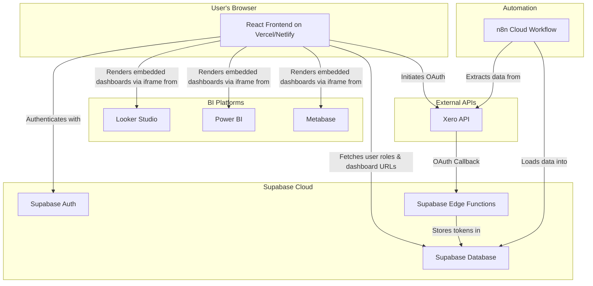

# Centralized BI Dashboard Portal - Architecture Document

**Version:** 1.0
**Date:** 2025-10-15
**Author:** Sarah (Product Owner)

---

## 1. Introduction

This document outlines the technical architecture for the Centralized BI Dashboard Portal. Its purpose is to provide a comprehensive blueprint for development, ensuring that the system is scalable, secure, and aligns with the project's goals as defined in the PRD.

The system is designed to be a lightweight, secure web portal that provides role-based access to embedded business intelligence dashboards. It leverages a modern, serverless-first technology stack to ensure rapid development and maintainability.

## 2. High-Level Architecture

The system is composed of five primary components: a **React Frontend**, a **Supabase Backend**, an **n8n ETL Pipeline**, external **BI Tools**, and the **Xero API**.

### Component Responsibilities

* **React Frontend:** The user-facing application. Handles user authentication, renders the dashboard portal, and manages the UI for the Xero connection wizard.
* **Supabase Backend:** Provides all backend services, including user authentication, database storage for user profiles and BI data, and serverless functions for secure API interactions.
* **n8n ETL Pipeline:** An automated workflow responsible for extracting data from Xero and loading it into the Supabase database daily.
* **BI Tools (Looker, Power BI, Metabase):** The platforms where dashboards are created. The portal embeds views from these tools.
* **Xero API:** The external data source for financial information.

## 3. Technology Stack

| Category | Technology | Rationale |
| :--- | :--- | :--- |
| **Frontend Framework** | React (with Vite) & TypeScript | Aligns with the existing codebase, offers a robust component model, and ensures type safety. Vite provides a superior development experience. |
| **UI Components** | Shadcn UI / Tailwind CSS | Leverages the existing, modern, and highly customizable component library, ensuring design consistency. |
| **Backend-as-a-Service** | Supabase | Provides a complete backend solution (Auth, Postgres DB, Edge Functions) that is secure, scalable, and easy to integrate with. |
| **Data Automation (ETL)** | n8n | A powerful, low-code platform for creating the automated data pipeline from Xero. |
| **BI & Visualization** | Google Looker Studio, Power BI, Metabase | Provides flexibility to use multiple industry-standard BI tools for dashboard creation and embedding. |
| **Deployment** | Vercel / Netlify | Industry-leading platforms for deploying modern web applications with seamless CI/CD. |

## 4. Frontend Architecture

The frontend is a single-page application (SPA) built with React and Vite.

* **Component Structure:** The application will follow a standard, feature-based component structure (e.g., `src/components/auth`, `src/components/dashboard`, `src/components/settings`).
* **State Management:** For simple state needs, React's native `Context` and `useState`/`useReducer` hooks will be used. For more complex, cross-application state (like user session), a lightweight library like Zustand may be considered if needed.
* **Routing:** `react-router-dom` will be used for all client-side routing (e.g., `/login`, `/dashboard`, `/settings`).
* **Data Fetching:** Direct integration with the Supabase client library (`@supabase/supabase-js`) will be used for all database interactions.

## 5. Backend Architecture (Supabase)

### 5.1. Database Schema

The Supabase Postgres database will contain the following key tables. All existing tables from the PolicyAI application will be preserved.

**`profiles` (Existing, to be utilized)**
Links `auth.users` to application roles.

| Column | Type | Notes |
| :--- | :--- | :--- |
| `id` | `uuid` (PK) | Foreign key to `auth.users.id` |
| `role` | `text` | e.g., 'admin', 'role_a', 'role_b' |
| `...` | | Other profile fields |

**`dashboards` (New Table)**
Stores information about each available dashboard.

| Column | Type | Notes |
| :--- | :--- | :--- |
| `id` | `uuid` (PK) | |
| `name` | `text` | e.g., 'Income vs Expenses' |
| `embed_url` | `text` | The `<iframe>` source URL |
| `bi_tool` | `text` | 'looker', 'powerbi', 'metabase' |

**`dashboard_permissions` (New Table)**
A many-to-many join table linking roles to the dashboards they can access.

| Column | Type | Notes |
| :--- | :--- | :--- |
| `role` | `text` (PK) | e.g., 'admin', 'role_a' |
| `dashboard_id` | `uuid` (PK, FK) | Foreign key to `dashboards.id` |

**`xero_connections` (New Table)**
Securely stores connection details for each user's Xero account.

| Column | Type | Notes |
| :--- | :--- | :--- |
| `id` | `uuid` (PK) | |
| `user_id` | `uuid` (FK) | Foreign key to `auth.users.id` |
| `tenant_id` | `uuid` | The Xero Tenant ID |
| `encrypted_refresh_token` | `text` | Refresh token encrypted at rest |
| `connected_at` | `timestamptz` | |

**`xero_data_cache` (New Table Example)**
A table to store the data pulled from Xero by the n8n pipeline.

| Column | Type | Notes |
| :--- | :--- | :--- |
| `date` | `date` | |
| `weekly_income` | `numeric` | |
| `avg_wages` | `numeric` | |
| `...` | | Other relevant financial metrics |

### 5.2. Authentication & Authorization

* **Authentication:** Handled entirely by **Supabase Auth**.
* **Authorization:** Role-based access control (RBAC) will be enforced via **Row Level Security (RLS)** policies on all tables, ensuring users can only access data they are permitted to see.

### 5.3. Serverless Logic (Supabase Edge Functions)

Two critical Edge Functions will be created to handle the Xero OAuth 2.0 flow securely.

1. **`xero-oauth-callback`**:
    * Receives the callback from Xero after a user authorizes the connection.
    * Exchanges the authorization code for an access token and refresh token.
    * Encrypts the refresh token.
    * Saves the `tenant_id` and encrypted token to the `xero_connections` table.
2. **`xero-refresh-token`**:
    * A function that can be called by the n8n pipeline (or other secure services) to get a fresh, short-lived access token using the stored refresh token. This ensures the refresh token is never exposed.

## 6. Data & ETL Architecture

* The **n8n workflow** will run on a daily schedule.
* It will use the Xero API to extract financial and operational data.
* The workflow will perform any necessary transformations (e.g., calculating rolling averages).
* Finally, it will `UPSERT` the transformed data into the `xero_data_cache` table in Supabase.

## 7. Integration Architecture

### 7.1. Xero API Integration (Self-Service Wizard)

The user-facing connection wizard will follow the standard OAuth 2.0 Authorization Code Flow.

1. **User Initiates:** User clicks "Connect to Xero" in the React frontend.
2. **Redirect to Xero:** The frontend redirects the user to the Xero authorization URL with the appropriate scopes.
3. **User Authorizes:** User logs in to Xero and approves the connection.
4. **Callback to Edge Function:** Xero redirects the user back to the `xero-oauth-callback` Edge Function with an authorization code.
5. **Token Exchange & Storage:** The Edge Function securely handles the token exchange and storage as described in section 5.3.
6. **Redirect to Frontend:** The Edge Function finally redirects the user back to the React frontend, which can now show a "Connected" status.

### 7.2. BI Tool Integration

Dashboards from Looker Studio, Power BI, and Metabase will be embedded directly into the frontend using `<iframe>` elements. The `embed_url` for each dashboard will be stored in the `dashboards` table, and the frontend will dynamically render the correct iframes based on the user's role.

## 8. Deployment & DevOps

* **Infrastructure:** The entire application will be deployed to Vercel (or Netlify).
* **CI/CD:** The deployment platform's Git integration will be used to automatically build and deploy the application on every push to the `main` branch.
* **Environments:** Supabase's branching feature can be used to create separate `dev` and `staging` environments for testing database changes before deploying to `production`.

## 9. Security

* **Authentication:** All access is gated by Supabase Auth.
* **Authorization:** RLS policies are the primary mechanism for data security, ensuring strict data isolation.
* **Secrets Management:** All API keys, service roles, and other secrets will be stored as environment variables in Vercel/Netlify and Supabase, NEVER hardcoded in the repository.
* **Token Security:** The Xero refresh token is the most sensitive piece of user data. It will be encrypted at rest in the database and only ever accessed by secure, server-side Edge Functions.
