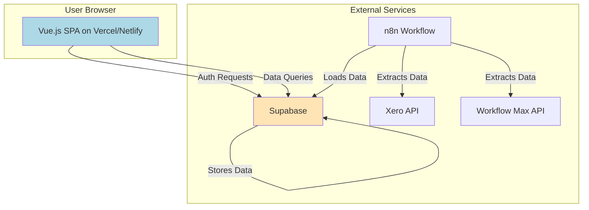

# Centralized BI Dashboard Portal Fullstack Architecture Document

## Introduction

This document outlines the complete fullstack architecture for the Centralized BI Dashboard Portal, including the Vue.js frontend, Supabase backend services, and their integration. It serves as the single source of truth for AI-driven development, ensuring consistency across the entire technology stack.

### Starter Template or Existing Project

The project will be built using the **Dashibase boilerplate**. My analysis of the provided source files confirms it uses **Vue.js 3, Vite, Pinia, and Tailwind CSS**, and is pre-configured for integration with Supabase. All architectural decisions will align with the patterns and dependencies established in this boilerplate.

### Change Log

| Date | Version | Description | Author |
| :--- | :--- | :--- | :--- |
| 2025-09-23 | 1.0 | Initial architecture draft based on Vue.js stack. | Winston (Architect) |

-----

## High Level Architecture

### Technical Summary

The application will be a single-page application (SPA) built with Vue.js and Vite. It will leverage Supabase for all backend services, including user authentication and the Postgres database. Data will be fed into Supabase via a separate n8n workflow. The architecture is a serverless-first, monolithic frontend application that relies on external services for its data and backend logic, deployed on a static hosting platform like Vercel or Netlify.

### Platform and Infrastructure Choice

  * **Platform**: Supabase will provide all backend-as-a-service functionality.
  * **Key Services**:
      * **Supabase Auth**: For user registration, login, and session management.
      * **Supabase Postgres**: For storing user profiles, roles, and BI data.
      * **n8n**: For the ETL data pipeline from Xero and Workflow Max.
  * **Deployment Host**: Vercel or Netlify.

### Repository Structure

  * **Structure**: Monorepo. The Dashibase boilerplate is a single repository containing the entire Vue.js application.

### Architecture Diagram



-----

## Tech Stack

This is the definitive technology selection for the project, based on the `dashibase` boilerplate.

| Category | Technology | Version | Purpose | Rationale |
| :--- | :--- | :--- | :--- | :--- |
| Frontend Language | TypeScript | \~4.6.4 | Primary development language | Provided by boilerplate |
| Frontend Framework | Vue.js | \~3.2.25 | Core UI framework | Provided by boilerplate |
| UI Component Library| Headless UI | \~1.6.1 | Unstyled, accessible UI components | Provided by boilerplate |
| State Management | Pinia | \~2.0.14 | Centralized state management | Provided by boilerplate |
| Backend Services | Supabase | N/A | Auth, Database, Storage | Aligns with PRD requirements |
| Database | Supabase Postgres | N/A | Primary data store | Aligns with PRD requirements |
| Data Automation | n8n | N/A | ETL pipeline from Xero/WFM | Aligns with PRD requirements |
| Build Tool | Vite | \~2.9.9 | Frontend build and dev server | Provided by boilerplate |
| CSS Framework | Tailwind CSS | \~3.0.24 | Utility-first CSS framework | Provided by boilerplate |

-----

## Data Models

### `profiles` Table

  * **Purpose**: To link authenticated users from `auth.users` to their application-specific roles.
  * **Key Attributes**:
      * `id` (UUID, Primary Key, Foreign Key to `auth.users.id`)
      * `role` (text) - e.g., 'admin', 'role\_a', 'role\_b'
      * `created_at` (timestamp with time zone)
  * **TypeScript Interface**:
    ```typescript
    interface Profile {
      id: string;
      role: 'admin' | 'role_a' | 'role_b';
      created_at: string;
    }
    ```

### BI Data Tables

  * **Purpose**: To store the transformed data from Xero and Workflow Max. The exact schema will be determined by the data pipeline development in Epic 1 and 3, but will include tables for financial summaries and WIP data.

-----

## Unified Project Structure

The project will adhere to the file structure established by the `dashibase` boilerplate.

```plaintext
/src
├── assets/
│   └── dashibase-light.png
├── components/
│   ├── auth/
│   │   ├── LogIn.vue
│   │   └── SignUp.vue
│   ├── branding/
│   │   ├── AppLogo.vue
│   │   └── PoweredBy.vue
│   └── dashboard/
│       ├── elements/
│       ├── modals/
│       ├── views/
│       ├── Dashboard.vue
│       └── SidePanel.vue
├── router/
│   └── index.ts
├── utils/
│   ├── config.ts
│   ├── dashboard.ts
│   ├── supabase.ts
│   └── store.ts
├── App.vue
├── dashibaseConfig.ts
└── main.ts
```

-----

## Development Workflow

### Local Development Setup

1.  Clone the repository.
2.  Install dependencies with `npm install`.
3.  Create a `.env` file and populate it with the Supabase URL and Anon Key.
4.  Run the development server with `npm run dev`.

### Environment Configuration

The application requires the following environment variables, which will be managed in a `.env` file and configured on the deployment platform (Vercel/Netlify).

```bash
# Supabase Credentials
VITE_SUPABASE_URL="https://YOUR_PROJECT_ID.supabase.co"
VITE_SUPABASE_ANON_KEY="YOUR_SUPABASE_ANON_KEY"
```

-----

## Deployment Architecture

### CI/CD Pipeline

The boilerplate includes GitHub Actions workflows (`.github/workflows/deploy.yml`) for continuous deployment to an AWS S3 bucket with CloudFront invalidation. We will adapt this to deploy to Vercel or Netlify, which offer seamless integration with GitHub repositories.

### Environments

| Environment | URL | Purpose |
| :--- | :--- | :--- |
| Development | `http://localhost:3000` | Local development |
| Staging | `staging-url.vercel.app` | Pre-production testing |
| Production | `production-url.vercel.app` | Live environment |

-----

## Security and Performance

### Security Requirements

  * **Authentication**: All user-facing routes, except for login/signup, will be protected. Authentication will be managed by Supabase Auth, leveraging its built-in security features.
  * **Authorization**: Data access will be controlled by Row Level Security (RLS) policies in Supabase, ensuring users can only query data relevant to their role.
  * **Secrets**: All secret keys (Supabase keys, API keys for n8n) will be stored as environment variables and never exposed on the client side.

### Performance Optimization

  * **Frontend**: The use of Vite provides fast builds and Hot Module Replacement (HMR). The application itself is a lightweight shell.
  * **Data**: The primary performance consideration will be the efficiency of the Supabase queries and the data refresh time of the n8n workflow.

-----