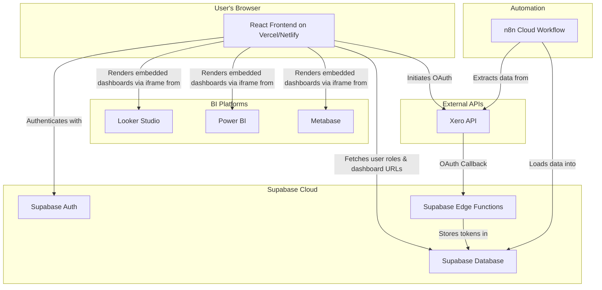

# High-Level Architecture

[← Back to Index](index.md)

---

## 2. System Overview

The system is composed of five primary components: a **React Frontend**, a **Supabase Backend**, an **n8n ETL Pipeline**, external **BI Tools**, and the **Xero API**.

### Component Responsibilities

* **React Frontend:** The user-facing application. Handles user authentication, renders the dashboard portal, and manages the UI for the Xero connection wizard.
* **Supabase Backend:** Provides all backend services, including user authentication, database storage for user profiles and BI data, and serverless functions for secure API interactions.
* **n8n ETL Pipeline:** An automated workflow responsible for extracting data from Xero and loading it into the Supabase database daily.
* **BI Tools (Looker, Power BI, Metabase):** The platforms where dashboards are created. The portal embeds views from these tools.
* **Xero API:** The external data source for financial information.

## 4. Frontend Architecture

The frontend is a single-page application (SPA) built with React and Vite.

* **Component Structure:** The application will follow a standard, feature-based component structure (e.g., `src/components/auth`, `src/components/dashboard`, `src/components/settings`).
* **State Management:** For simple state needs, React's native `Context` and `useState`/`useReducer` hooks will be used. For more complex, cross-application state (like user session), a lightweight library like Zustand may be considered if needed.
* **Routing:** `react-router-dom` will be used for all client-side routing (e.g., `/login`, `/dashboard`, `/settings`).
* **Data Fetching:** Direct integration with the Supabase client library (`@supabase/supabase-js`) will be used for all database interactions.

## 8. Deployment & DevOps

* **Infrastructure:** The entire application will be deployed to Vercel (or Netlify).
* **CI/CD:** The deployment platform's Git integration will be used to automatically build and deploy the application on every push to the `main` branch.
* **Environments:** Supabase's branching feature can be used to create separate `dev` and `staging` environments for testing database changes before deploying to `production`.
